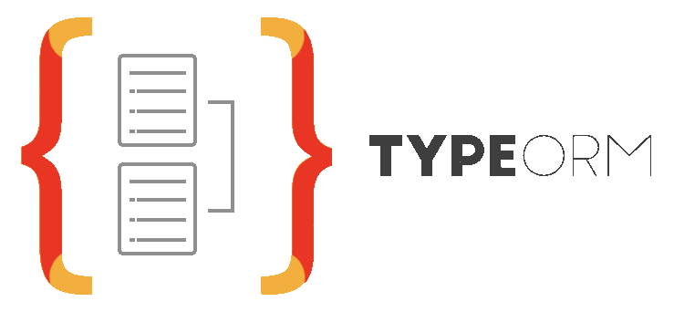

<p align="center">
   
</p>
<p align="center">
  <a href="https://heroku-badge.herokuapp.com/projects.html">
    
  </a>
  
  
</p>

<div align="center">
  <sub>Made by ( ) => 
    <a href="https://victorsoares96.netlify.app">Victor Soares</a>
  </sub>
</div>

# Demo
[View the demo here](https://typeorm-api.herokuapp.com/)

# Made with
This project was made using the follow technologies:

* [Typescript](https://www.typescriptlang.org/)      
* [Typeorm](https://typeorm.io/)
* [JWT](https://jwt.io/)
* [Docker](https://www.docker.com/)

# Deploy with
This project was deployed using the follow...

* [Heroku](https://heroku.com)

# How to run?

### 1 - Clone Repository and Install Dependencies
```bash
$ git clone https://github.com/victorsoares96/typeorm-api.git

$ yarn install
```

### 2 - Configure ormconfig.env vars
```bash
PORT = 
SECRET_KEY = 

TYPEORM_CONNECTION = 
TYPEORM_HOST = 
TYPEORM_USERNAME = 
TYPEORM_PASSWORD = 
TYPEORM_DATABASE = 
TYPEORM_PORT = 
TYPEORM_SYNCHRONIZE = 
TYPEORM_LOGGING = 

TYPEORM_ENTITIES = 
TYPEORM_ENTITIES_DIR = 

TYPEORM_MIGRATIONS = 
TYPEORM_MIGRATIONS_DIR = 

TYPEORM_SUBSCRIBERS = 
TYPEORM_SUBSCRIBERS_DIR = 

TYPEORM_DRIVER_EXTRA =
```

### 3 - Run Migrations
```bash
$ yarn typeorm migration:run
```

### 4 - Run Project
```bash
### Run in dev mode
$ yarn dev

### Run in prod mode
$ yarn build
$ yarn start
```

Access API at http://localhost:3000/

Give a ⭐️ if this project helped you!
